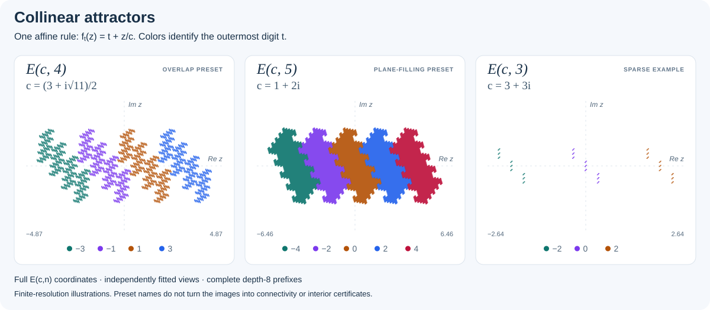
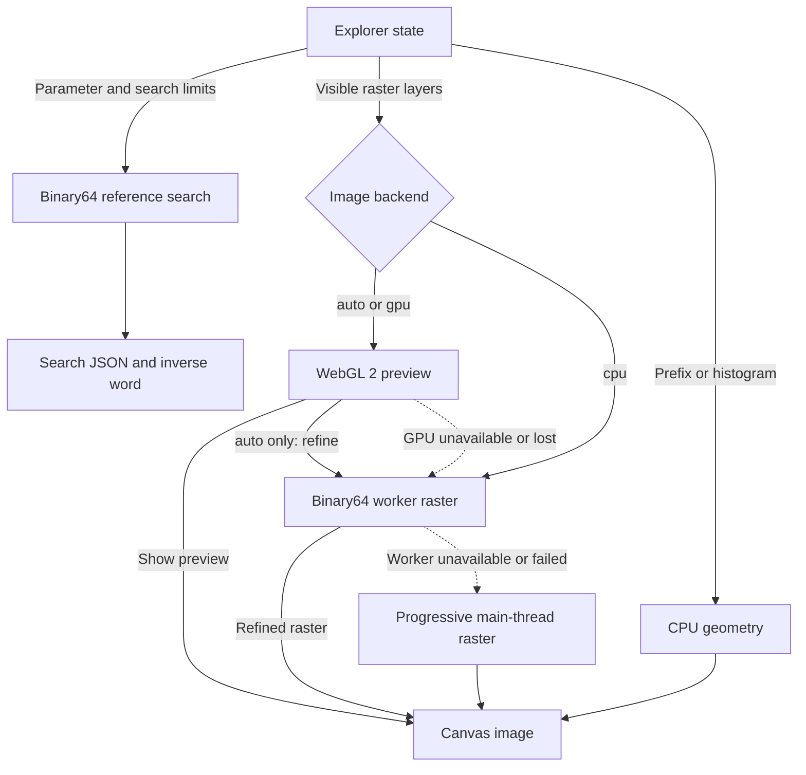
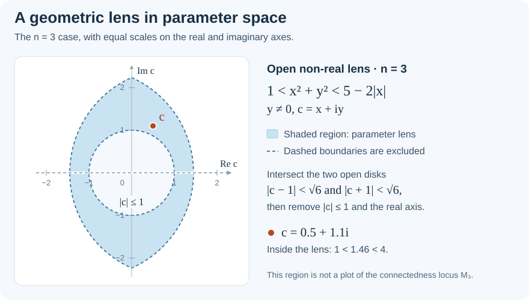

# Collinear Fractals Explorer

**Explore collinear self-similar sets, connectedness loci, and finite capture.**

[Open the explorer](https://complextrees.com/collinear-fractals-gpu/) ·
[Examples](examples/README.md) · [Mathematical conventions](docs/IMPLEMENTATION_NOTES.md) ·
[Validation](docs/VALIDATION.md) · [Citation metadata](CITATION.cff)

Author: **Bernat Espigule**. Release line: **0.2.0-alpha**.
Changes after that release are listed under [Unreleased](CHANGELOG.md).

This repository contains a build-free browser explorer and reference packages
for inverse search in the collinear connectedness loci $\mathcal{M}_n$.
The browser combines **WebGL 2 previews with binary64 CPU refinement**. Its
default automatic mode displays a bounded GPU approximation, then refines the
pixel search at the requested settings in Web Workers. The default original
attractor view uses adaptive capture-and-escape boundary rendering, with
first-level piece colors. Unsupported GPU views
use CPU rendering; the existing progressive main-thread renderer is retained
for environments without working workers.

Search results use floating-point arithmetic. They are reproducible numerical
evidence, with finite inverse words when capture succeeds. Turning such a
result into a mathematical certificate requires justified error bounds and the
hypotheses of the corresponding theorem.

## Quick visual summary



These are complete depth-eight prefix illustrations of $E(c,n)$, using
$f_t(z)=t+z/c$. Each panel has its own fitted scale; colors identify the first
digit. Finite resolution and visible point sizes make these illustrations,
not mathematical certificates. [Figure data and reproduction](docs/figures/README.md)
record the exact parameters, tails, and display settings.
Their interactive links open the sharper boundary renderer at the same
parameters and coordinate spans; the static figures retain their prefix construction.

**Explore these examples:** [Four-piece attractor][view-e4] ·
[Five-piece attractor][view-e5] · [Sparse three-piece attractor][view-e3].

The workspace opens in **Split** view at $n=4$,
$c=(3+i\sqrt{11})/2$: the parameter plane is linked to the original
attractor $E(c,4)$, colored by its first-level pieces. Focus either plane or
use fullscreen; quick arity, zoom, fit, and scene controls stay beside the plots.
The **Controls** drawer contains examples, Cartesian and polar parameter
entry, search limits, renderers, layers, palettes, and exports.

Switch the dynamical scene between $E(c,n)$, the half-scale difference
$\frac{1}{2}E(c,2n-1)$, and their overlay. The parameter plane offers
$\mathcal{M}_n$, $\mathcal{M}_n^0=\{c:c\in E(c,n)\}$,
$\mathcal{M}_n^1=\{c:c\in A_{n-1}+c^{-1}E(c,n)\}$, and a comparison.
The old name $R_n$ imports as $\mathcal{M}_n^0$. In $\mathcal{M}_n^1$,
only the first digit comes from the complementary alphabet $A_{n-1}$;
all later digits come from $A_n$. These two views are not presented as a
decomposition of the full connectedness locus.

**Sharp boundary** evaluates the original attractor at pixel scale. It uses
capture only where the original alphabet has a canonical self-covering trap,
and otherwise follows inverse branches until escape, finite-depth survival,
or a work limit. Finite survivors describe visual coverage; unfinished work
remains unresolved. Automatic depth starts at 16 for two maps and 12 otherwise,
and adapts to zoom and raster resolution. Prefix, seeded histogram, and
survival rendering remain available as advanced views. The selected
$\mathcal M_n$ search keeps its independent depth and frontier-width limits.

Share links, captioned image export, search JSON, and undo/redo retain the
reproducible research workflow. The drawer becomes a modal on narrow screens;
canvas navigation, dialogs, and controls support keyboard operation.

## Rendering engines

Choose **Controls → Rendering engine** to set a portable backend preference:

| Preference | Image computation and completion |
|---|---|
| **Automatic · GPU + refinement** (`auto`, default) | WebGL 2 supplies a bounded float32 preview when supported. Binary64 CPU workers then refine the full raster using the applicable search or adaptive boundary settings. |
| **GPU preview** (`gpu`) | Explicitly finish with the bounded float32 preview. Its effective search or boundary limits can be lower than requested. Unsupported views fall back to CPU computation. |
| **CPU precision** (`cpu`) | Use binary64 CPU workers directly. If workers are unavailable or fail, use progressive computation on the main thread. |

The **selected search record always uses the binary64 reference search** and
the requested `kMax`, `LMax`, and tolerance, independently of image backend
or boundary depth. The default sharp boundary view runs through the GPU/worker
raster pipeline. Advanced prefix-cylinder
and seeded-histogram drawings of $E(c,n)$ remain CPU Canvas overlays in all
three modes. A GPU preview is not a completed binary64 refinement, and neither
arithmetic mode supplies an interval-verified proof.

The interface reports the active backend separately from the saved preference.
Deep zooms, unsupported arities, insufficient shader precision, and WebGL
failure can trigger CPU fallback without changing `backend=gpu` in a share
link. [Rendering architecture](docs/RENDERING_ARCHITECTURE.md) documents the
preview limits, worker scheduling, arithmetic boundaries, and WebGPU decision.

<details>
<summary>Diagram: image rendering and the independent search record</summary>



In automatic mode, the preview appears first and workers refine the raster at
the requested limits. In GPU mode, a successful preview remains the displayed
raster. Prefix and histogram geometry can render alone or be composited over
raster layers. The selected search record follows its separate reference path.

</details>

## Browser quick start

Clone the repository and serve its root:

```bash
git clone https://github.com/espigule/collinear-fractals-gpu.git
cd collinear-fractals-gpu
python3 -m http.server 8000
```

Open [localhost:8000](http://localhost:8000/) in a modern browser. An HTTP server
is required for reliable ES-module and preset loading; opening `index.html`
as a local file is not the supported workflow.

A useful first example is `n = 3`, `c = 0.5 + 1.1i`. Its marked point is already
inside the trap and the search returns `Interior` at depth zero. Compare with
`c = 3 + 3i`, which returns `Exterior` from the initial enclosure test.
For a one-step capture word, use `n = 3`, `c = 0.7 + 1.4i` and inspect `[2]`.

**Parameter convention:** the browser interprets a nonzero input $p$ inside
the unit disk as the reciprocal coordinate, using $c=1/p$. Outside the unit
disk it uses $c=p$. The language packages take the expanding parameter $c$
directly. Non-real $c$ with $|c|>1$ is the domain of this canonical search;
real-axis and unit-circle inputs are not classified by it. See
[the input and output contract](docs/IMPLEMENTATION_NOTES.md#input-domain-and-coordinates).

## What is included

| Path | Contents and current status |
|---|---|
| `index.html`, `index.css`, `explorer.js` | Linked browser explorer, Canvas composition, and backend selection. |
| `src/` | Numerical reference kernels, bounded WebGL 2 preview, CPU raster scheduler, state modules, and visual renderers. |
| `workers/` | Module raster worker used for binary64 image refinement, plus standalone search/histogram entry points. |
| `javascript/`, `python/` | Executable reference packages and regression tests. |
| `swift/` | Swift Package Manager reference implementation and tests. |
| `mathematica/`, `matlab/`, `maple/` | Reference ports requiring validation in their native runtimes. |
| `examples/` | Presets, parameters, search records, and reproduction notes. |
| `docs/figures/` | Rendered README figures, parameters, and reproduction notes. |
| `gallery/` | Metadata for planned curated assets; no rendered gallery yet. |
| `paper_figures/` | Figure-job manifest and listing script; no batch figure renderer yet. |
| `schemas/` | JSON Schemas for search exports, examples, and figure metadata. |
| `qa/`, `tools/`, `docs/` | Regression checks, validation tools, and maintenance documentation. |

CPU pixel rendering uses a scalar kernel with reusable typed-array frontiers,
scheduled in bounded worker tiles; original-attractor boundaries use a bounded
depth-first search. GPU preview classification and palette
mapping run in two WebGL 2 passes. The selected-parameter search retains its
detailed reference tree and inverse word. A per-pixel certificate inspector,
completed boundary atlas, and WebGPU backend remain future work.

## Mathematical scope

The conventions are

$$
A_m=\{-m+1,-m+3,\ldots,m-1\},\qquad
f_t(z)=t+\frac{z}{c},\quad |c|>1.
$$

Thus $E(c,m)$ consists of sums $\sum_{j=0}^{\infty}t_j c^{-j}$ with
$t_j\in A_m$. In particular, the first digit is **unscaled**. For
$N=2n-1$, the difference set is $E(c,n)-E(c,n)=E(c,N)$ and

$$
c\in\mathcal{M}_n\quad\Longleftrightarrow\quad 2c\in E(c,N).
$$

The **half-difference** scene displays $E(c,N)/2$; the **original attractor**
scene displays $E(c,n)$ with the unscaled first digit above. Overlay compares
these two sets in the same coordinates.

The search follows the marked point $2c$ under inverse branches
$g_t(z)=c(z-t)$, prunes against an enclosure, and tests for entry into a trap.
Writing $c=x+iy$ with nonzero imaginary part $y$, the canonical parameter
lens is characterized by

$$
1 < x^2+y^2 < 2n-1-2|x|.
$$



For $n=3$, the upper inequality means being inside **both** disks
$(x+1)^2+y^2<6$ and $(x-1)^2+y^2<6$. The lower inequality removes the unit
disk; $y\ne0$ removes the real axis. The shaded region shows this parameter
lens, rather than a computed connectedness locus.

These conventions and the finite-capture filtration are developed in the
[finite-capture paper](https://arxiv.org/abs/2603.07397).

That paper establishes the two-step closure inclusion for the finite-capture
layers and the sharp $n\geq20$ lens-containment threshold. The explorer
implements numerical searches associated with this framework; running it
does not independently verify those theorems or their full certificate corpus.

## Verdicts: Interior, Interior-offLens, Exterior, Undetermined

These are the selected $\mathcal{M}_n$ search labels. The optional
$\mathcal M_n^0$ and $\mathcal M_n^1$ views have separate original-alphabet
membership searches. They allow capture only when
$|c|^2+2|\mathrm{Re}\,c|<n$, including valid even alphabets.
Finite-depth survival and work-cap termination remain `Undetermined`.
The historical label $R_n$ is accepted in old links; it is distinct from the
countable restricted-polynomial root set $\mathcal R_n$ in the finite-capture paper.

| Verdict | Meaning of the numerical search result |
|---|---|
| `Interior` | Strict trap entry for an in-lens parameter. |
| `Interior-offLens` | Strict trap entry using the separate off-lens rule. |
| `Exterior` | Initial enclosure escape or exhaustion of the enclosure-admissible inverse tree. |
| `Undetermined` | A depth/width limit, unsupported input domain, or numerical-range limit prevented a conclusion. |

`Undetermined` does not assert boundary membership, connectedness, or
disconnectedness. `Interior-offLens` records a different trap rule and must
retain that provenance. All four labels describe the computation performed in
floating point, including the enclosure comparisons.

The defaults are `k_max = 37`, `L_max = 1000`, and `tol = 1e-8`.
`L_max` caps the retained nodes **at one depth**, not the total nodes explored.
The search stops conservatively when that cap is reached; `k_max = 0` performs
only the initial trap/enclosure test. The tolerance controls the truncated
geometric tail, not a bound on all floating-point rounding errors.

## Examples and gallery

| Example | Reproducible role |
|---|---|
| `theta0_base_capture`, `trap_enclosure_n3` | Initial trap/enclosure cases plus a one-step inverse word, with compact search JSON. |
| `e_c4_overlap` | Original attractor at $c=(3+i\sqrt{11})/2$, $n=4$; the default search is `Undetermined`. |
| `e_c5_plane_filling` | Original attractor at $c=1+2i$, $n=5$; the default search is `Undetermined`. |
| `off_lens_witnesses_n2_to_n19` | One numerical off-lens example for $n=3$; the directory name is retained for existing links. |
| `hole_zoom_n13` | An `Exterior` sample near an $n=13$ hole; one sample does not establish the topology of a hole. |
| `finite_capture_layers_n3` | View for comparing finite-search depth layers. |
| `threshold_n20` | Exploratory starting point at $n=20$. |
| `level2_boundary_atlas` | A preset for future atlas work; no completed atlas is supplied. |

See [the example guide](examples/README.md) for exact parameters, limits, and
status. The [README figures](docs/figures/README.md) are rendered and
reproducible. The separate `gallery/` and `paper_figures/` manifests describe
future curated assets. Save Image exports the completed browser view with
parameter and search captions; `paper_figures/make_all_figures.py` only lists
planned jobs.

## Share URLs and reproducible states

Share records the selected parameter, viewports, search limits, palette,
parameter-set and scene modes, backend preference, layers, renderer, boundary
depth and adaptation, advanced prefix depth, histogram seed/sample count,
piece coloring, and opacity in the URL fragment. The boundary keys are
`bdepth=0` for automatic base depth and `badapt=1` for adaptation; explicit base
depths range from 1 to 100. Old `pm=rn` links become canonical `pm=mn0` when
shared again. A share link restores the
view; a search JSON export records the numerical result.

For a reproducible issue or figure, retain both, together with the git commit
or release used. Floating-point behavior near decision boundaries can depend
on the runtime. A fixed histogram seed reproduces a sample sequence within the
same implementation; it does not make the sampled picture exact.

Presets load from `examples/examples.json`, with a built-in fallback for the
same public list.

Legacy links can import the original parameter, selected sets, center, and
vertical view span. An explicit `legacy=1` query flag distinguishes abbreviated
old links from current links; a recognized hash takes precedence over query
state. Old shader, thickness, and queue settings retain their meaning only in
the archived explorer and are not silently applied to the current search.

The maintained deployment belongs to this project's Pages build at
`/collinear-fractals-gpu/`. The public routing plan keeps `/collinear/` as a
compatibility redirect that preserves query and hash while identifying legacy
state, and preserves the original HTML at `/collinear/legacy-2026-09/`.
See [the comparison and public-explorer decision](docs/EXPLORER_COMPARISON_2026-09.md)
for the implementation and archive boundaries.

## Package tests

From the repository root, install the development dependencies and run:

```bash
npm ci
python3 -m pip install -r requirements-qa.txt
npx playwright install chromium
npm run test:all
```

Use Node.js 22 or later and Python 3.11 or later. `npm test` runs the
non-browser suite, while `npm run test:browser` runs real Chromium checks.
If needed, use `PYTHON=python3 npm test` to select the Python executable.

With Swift installed:

```bash
swift test --package-path swift --jobs 2
```

[Validation notes](docs/VALIDATION.md) describe the complete browser and CI
workflow, dependencies, and manual checks. Package READMEs contain language
API examples.

## QA status and limitations

Numerical regression tests compare known search cases, input validation,
enclosure calculations, digit parity, renderer coordinates, and deterministic
sampling. Agreement between ports checks consistency, not mathematical rigor.
The browser and schema checks exercise separate concerns: user interactions
and reproducibility data.

[The original release report](docs/QA_REPORT.md) is a historical record for
`0.2.0-alpha`; it is not a test result for a newer checkout. Run the validation
suite and consult the CI result for the commit you use. Native Wolfram
Language, MATLAB, Maple, and Swift checks require their respective runtimes;
absence of a runtime is not a passing test.

Rendering and search costs rise with arity, depth, and viewport resolution.
Boundary rendering has explicit depth/work caps; it keeps exhausted work
distinct from completed finite survival. Prefix drawings use bounded point
counts; histogram drawings are sampled.
GPU previews have explicit resolution, search, and numerical limits; automatic
refinement uses the requested CPU limits. No physical-device GPU speedup or
cross-browser performance benchmark is claimed by this documentation.
Neither a rendered pixel nor an exported floating-point search record is an
interval-arithmetic proof. See [numerical interpretation](docs/RESPONSIBLE_USE.md).

## Related mathematical work

1. Bernat Espigule, David Juher, and Joan Saldaña,
   [“Collinear Fractals and Bandt's Conjecture”](https://doi.org/10.3390/fractalfract8120725),
   *Fractal and Fractional* 8(12), article 725, 2024.
   The original covering framework gives the global non-real result for
   $n\geq21$; an [author version is on arXiv](https://arxiv.org/abs/2411.00160).
2. Bernat Espigule and David Juher,
   [“Finite capture and the closure of roots of restricted polynomials”](https://arxiv.org/abs/2603.07397),
   arXiv:2603.07397, 2026. The canonical trap/enclosure framework, finite-capture
   layers, two-step closure theorem, and sharp $n\geq20$ threshold.
3. Bernat Espigule,
   [“Finite capture and the closure of roots of restricted polynomials”](https://www.carmin.tv/en/video/finite-capture-and-the-closure-of-roots-of-restricted-polynomials),
   IHP audiovisual resource, recorded 27 March 2026.
   DOI: [10.57987/IHP.2026.T1.WS3.016](https://doi.org/10.57987/IHP.2026.T1.WS3.016).

## Citing

Use [CITATION.cff](CITATION.cff) for software metadata and cite the relevant
mathematical paper separately. Include the exact version or commit used.

**About & cite → References** copies a software citation or BibTeX entry,
including the full source commit when the deployed build manifest is available.
The original release citation is:

> Bernat Espigule, *Collinear Fractals GPU: companion software for collinear
> fractals, finite capture, and restricted polynomial roots*, version
> 0.2.0-alpha, 2026.

The release metadata currently records no archival software DOI. Do not use a
paper DOI as though it identified a software release.

## Funding and acknowledgements

Parts of the mathematical framework, validation materials, examples, and
companion software were developed during Bernat Espigule's doctoral research
at the Universitat de Girona, supervised by Dr. Joan Saldaña Meca and
Dr. David Juher Barrot.

This work was supported by the Spanish Ministerio de Ciencia, Innovación y
Universidades through project PID2023-146424NB-I00, by the Generalitat de
Catalunya through grant 2021 SGR 00113, and by the Universitat de Girona and
Banco Santander Grant Programme for Researchers in Training, IFUdG 2022-2024.

The repository is maintained by Bernat Espigule. The funders, supervisors, and
affiliated institutions do not necessarily endorse the software or results
obtained with it.

## Support

Optional sponsorship supports maintenance, documentation, public
visualization, and research-software development. The code, examples,
documentation, issues, and citation materials remain openly accessible.

## License

Source code is distributed under the **Apache License 2.0**; see [LICENSE](LICENSE).
Documentation and non-code repository materials use **Creative Commons
Attribution 4.0 International** unless otherwise stated; see
[LICENSE-docs.md](LICENSE-docs.md) and [the full license](LICENSES/CC-BY-4.0.txt).

[view-e4]: https://complextrees.com/collinear-fractals-gpu/#n=4&k=37&l=1000&tol=1e-8&q=3&cx=1.5&cy=1.6583123951777&pz=2.414&dz=9.730607775891547&bdepth=0&adepth=8&hseed=20260227&hsamples=50000&aop=0.92&sop=0.45&pcx=1.207&pcy=1.207&dcx=0&dcy=0&backend=auto&pm=mn&mode=collinear&renderer=boundary&palette=research&focus=dynamical&pieces=1&badapt=1&layers=0100000&ci=%23059669&co=%232563eb&cu=%23fbbf24&ce=%23ffffff
[view-e5]: https://complextrees.com/collinear-fractals-gpu/#n=5&k=37&l=1000&tol=1e-8&q=3&cx=1&cy=2&pz=2.414&dz=12.923663597204854&bdepth=0&adepth=8&hseed=20260227&hsamples=50000&aop=0.92&sop=0.45&pcx=1.207&pcy=1.207&dcx=0&dcy=0&backend=auto&pm=mn&mode=collinear&renderer=boundary&palette=research&focus=dynamical&pieces=1&badapt=1&layers=0100000&ci=%23059669&co=%232563eb&cu=%23fbbf24&ce=%23ffffff
[view-e3]: https://complextrees.com/collinear-fractals-gpu/#n=3&k=37&l=1000&tol=1e-8&q=3&cx=3&cy=3&pz=2.414&dz=5.284458204387503&bdepth=0&adepth=8&hseed=20260227&hsamples=50000&aop=0.92&sop=0.45&pcx=1.207&pcy=1.207&dcx=0&dcy=0&backend=auto&pm=mn&mode=collinear&renderer=boundary&palette=research&focus=dynamical&pieces=1&badapt=1&layers=0100000&ci=%23059669&co=%232563eb&cu=%23fbbf24&ce=%23ffffff
