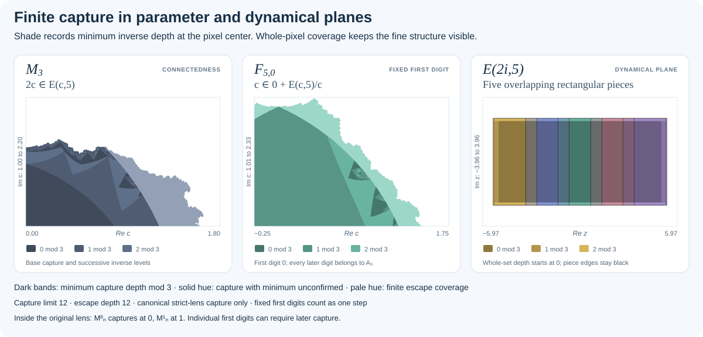

# README figures

These figures are committed documentation assets. They can be reproduced from
the repository with Node.js 22 or later and Python 3.10 or later, using only
their standard libraries. No plotting package or browser is needed.

From the repository root:

```bash
node tools/docs/generate_attractor_examples.mjs
python tools/docs/generate_parameter_lens.py
```

To verify the committed files without changing them:

```bash
node tools/docs/generate_attractor_examples.mjs --check
python tools/docs/generate_parameter_lens.py --check
```

Both checks are also included in `npm test` and continuous integration. The
companion JSON files record the parameters and construction details. SVG text
and descriptions remain available to assistive tools, and the main README
includes alternative text and nearby explanations.

## Original attractor examples


[Generator](../../tools/docs/generate_attractor_examples.mjs) ·
[Parameters and provenance](attractor-examples.json)

| Panel | Expanding parameter | Arity | Escape depth |
|---|---|---:|---:|
| Four-piece overlap preset | $(3+i\sqrt{11})/2$ | 4 | 12 |
| Five-piece plane-filling preset | $1+2i$ | 5 | 12 |
| Overlapping rectangular pieces | $2i$ | 5 | 12 |

The generator uses the explorer's binary64 capture-and-escape raster,
support-bound, palette, and per-piece contour modules. It evaluates a
dynamical pixel footprint against $E(c,n)$ in the original convention
$f_t(z)=t+z/c$. The first digit is unscaled. Every first-level piece is
searched separately with that digit fixed, so the compositor retains
overlap information and can draw boundaries inside another piece.

This gallery explicitly uses `capture=sets`: colors identify the outermost
digit and overlapping fills average their colors. The current renderer still
computes its separate center-capture field; flat colors leave that field
unshaded. The capture triptych below shows the default depth encoding.
Black contours mark a covered piece sample next to an explicitly absent
neighbor of the same piece. Unresolved work does not count as absence.
The axes have equal units within each panel. Each panel is fitted separately,
so the three images do not share a common magnification.

Finite-depth survival and pixel coverage determine the displayed
approximation; they do not establish connectedness, interior, or a selected
search verdict. The first two panel labels use the names of the existing
presets. The third panel has the independently derived support
$E(2i,5)=[-16/3,16/3]\times[-8/3,8/3]$ and overlapping rectangular
first-level pieces. It makes boundaries lying inside another piece visible
and exercises the original-alphabet self-covering trap. The figure's finite
raster remains an approximation to those exact rectangles.

Each 332 × 220 plot embeds a 664 × 440 raster, using depth 12 and a work
limit of 20,000 digit evaluations per piece. Its separate center-capture
limit is 37. Original-piece opacity is one;
each piece's inward contour is one raster pixel wide. Coverage statistics,
exact viewports, source hashes, and image hashes are recorded in the metadata.

The metadata includes a fully encoded `interactive_url` for each panel. Those
links restore the corresponding parameter, original-attractor scene, colors,
and horizontal coordinate span using the sharp boundary renderer. The figure's
escape depth becomes the starting depth, with adaptation enabled so detail
increases during exploration. The live depth and pixel footprint depend on
zoom and canvas dimensions; GPU previews also have separate depth/work caps.
Use the generator's recorded fixed depth and raster dimensions to reproduce
the committed figures exactly.

The SVG embeds its three raster plots as PNG data, with vector titles, axes,
and legends. It has no external image or font dependencies. The JSON records
source-module and image hashes so a figure can be traced to its inputs.

## Finite-capture layers



[Generator](../../tools/docs/generate_attractor_examples.mjs) ·
[Parameters, capture counts, and provenance](finite-capture-layers.json)

**Explore these capture views:** [$\mathcal M_3$][capture-mn3] ·
[$F_{5,0}$][capture-f5-0] · [$E(2i,5)$][capture-e2i5].

| Panel | Capture point and alphabet | Geometric coverage | Viewport |
|---|---|---|---|
| $\mathcal M_3$ | $2c$ in $E(c,5)$; $A_5$ throughout. | Varying-parameter cell. | Center $(0.9,1.6)$; horizontal span 1.8. |
| $F_{5,0}$ | $c$, first digit 0, then $A_5$. | Varying-parameter cell. | Center $(0.75,1.67)$; horizontal span 2. |
| $E(2i,5)$ | Displayed $z$ in the original attractor; $A_5$. | Dynamical pixel footprint. | Center $(0,0)$; horizontal span 11.95. |

Each 332 × 220 plot embeds a 664 × 440 production CPU raster. The figure
sets **capture limit 12** and **escape depth 12** independently, with a
20,000-candidate work allowance for each search. The center minimum is found
by completing every shallower inverse-search level before proceeding. Cell
coverage follows its own bounded search; the figure never substitutes a
minimum at one center for capture of the full pixel.

The three shade bands encode depth modulo 3 while retaining the set/piece
hue. In particular, “0 mod 3” can mean depth 0, 3, 6, 9, or 12; it does not
identify the base layer by color alone. A witness with an unconfirmed minimum
or analytic membership without a canonical minimum keeps the solid hue;
finite escape coverage without a center capture is pale. In the
$\mathcal M_3$ panel, analytic inner-annulus coverage remains independent
of its canonical center-capture field. The exact counts of every minimum
depth and coverage code are in the
JSON metadata. Black contours remain independent of shading and trace each
first-level piece, including edges within another piece.

The third panel supplies an independent analytic check:
$E(2i,5)=[-16/3,16/3]\times[-8/3,8/3]$ and its canonical trap is
$|\mathrm{Re}\,z|<5$, $|\mathrm{Im}\,z|<5/2$. The points $0$,
$5.1$, and $2.55i$ have capture depths 0, 1, and 2. The latter two use
words $[4]$ and $[0,-4]$; earlier capture is excluded by the trap geometry.
The generator checks the production search and displayed samples at those
points. For $F_{5,0}$ it also checks that no depth-zero sample bypasses the
required first digit.

$\mathcal M_n^0$ is not given a fabricated multilevel panel: throughout
the strict original-alphabet lens, its marked point $c$ already lies in the
canonical trap and has capture depth zero. The complementary aggregate
$\mathcal M_n^1$ similarly captures at depth one in that lens by choosing
a complementary digit nearest to $2\mathrm{Re}\,c$. First-digit subsets
can have later levels even when their aggregate has already captured.

Each panel's `interactive_url` restores its view, finite-capture style,
cycle 3, and capture-depth limit 12. Boundary depth starts at 12 and adapts
with zoom and viewport resolution. Increase **Search depth** to explore
later capture levels; changing boundary detail alone does not change that
minimum-search limit. Current browser defaults use capture depth 37.

Both figure families are generated and checked by the same command. Source
hashes include the numerical kernels, raster compositor, palette, and state
codec. The pictures and minimum-depth counts are floating-point visualization
data, not interval-verified certificates.

## Parameter lens


[Generator](../../tools/docs/generate_parameter_lens.py) ·
[Parameters and provenance](parameter-lens.json)

Writing $c=x+iy$, the diagram shows

$$
1 < x^2+y^2 < 5-2|x|,\qquad y\ne0.
$$

The upper inequality is the intersection of the open disks centered at
$(-1,0)$ and $(1,0)$, both with radius $\sqrt{6}$. The closed unit disk and
the real axis are excluded. The marker $c=0.5+1.1i$ satisfies all three strict
conditions. Circular arcs describe the boundaries directly in the SVG;
the region is not estimated from a search raster.

This illustrates the canonical parameter lens for $n=3$. It is not a diagram
of the connectedness locus or the finite-capture layers. The coordinates use
the expanding parameter $c$, as in the reference packages.

## Rendering diagram

The hybrid rendering diagram is maintained directly in the root
[README](../../README.md#rendering-engines) as Mermaid source. It shows the
separate image and selected-reference-search paths, GPU-to-CPU refinement,
and the progressive CPU fallback. It does not require a generated asset.

[capture-mn3]: https://complextrees.com/collinear-fractals-gpu/#n=3&k=12&l=1000&tol=1e-8&q=3&cx=0.9&cy=1.6&pz=1.8&dz=8&bdepth=12&adepth=7&hseed=20260227&hsamples=50000&aop=1&sop=0.45&pcx=0.9&pcy=1.6&dcx=0&dcy=0&backend=auto&pm=mn&mode=collinear&renderer=boundary&palette=research&capture=depth&focus=parameter&pl=mn&pd=&pieces=1&badapt=1&layers=0100000&ci=%23059669&co=%232563eb&cu=%23fbbf24&ce=%23ffffff
[capture-f5-0]: https://complextrees.com/collinear-fractals-gpu/#n=5&k=12&l=1000&tol=1e-8&q=3&cx=0.75&cy=1.67&pz=2&dz=8&bdepth=12&adepth=7&hseed=20260227&hsamples=50000&aop=1&sop=0.45&pcx=0.75&pcy=1.67&dcx=0&dcy=0&backend=auto&pm=compare&mode=collinear&renderer=boundary&palette=research&capture=depth&focus=parameter&pl=&pd=0&pieces=1&badapt=1&layers=0100000&ci=%23059669&co=%232563eb&cu=%23fbbf24&ce=%23ffffff
[capture-e2i5]: https://complextrees.com/collinear-fractals-gpu/#n=5&k=12&l=1000&tol=1e-8&q=3&cx=0&cy=2&pz=2.414&dz=11.95&bdepth=12&adepth=7&hseed=20260227&hsamples=50000&aop=1&sop=0.45&pcx=1.207&pcy=1.207&dcx=0&dcy=0&backend=auto&pm=mn&mode=collinear&renderer=boundary&palette=research&capture=depth&focus=dynamical&pl=mn&pd=&pieces=1&badapt=1&layers=0100000&ci=%23059669&co=%232563eb&cu=%23fbbf24&ce=%23ffffff
